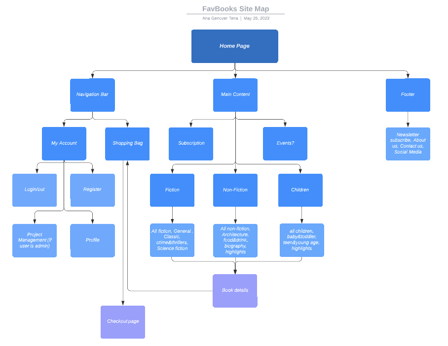
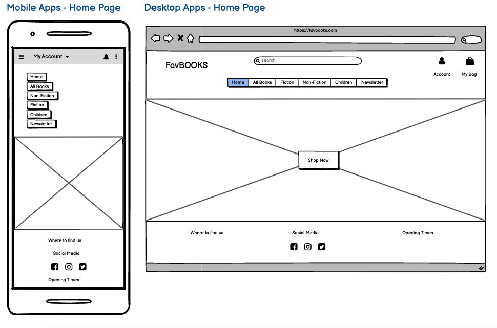
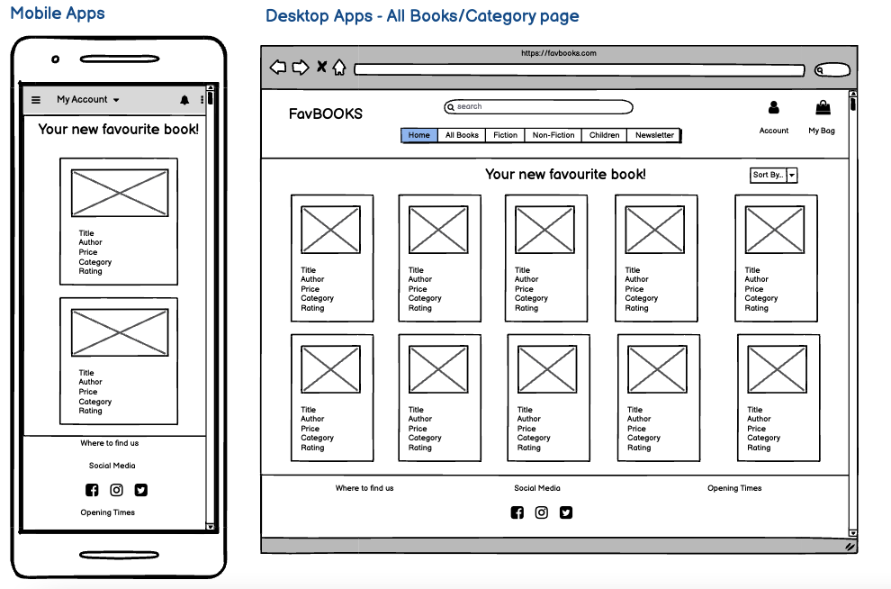
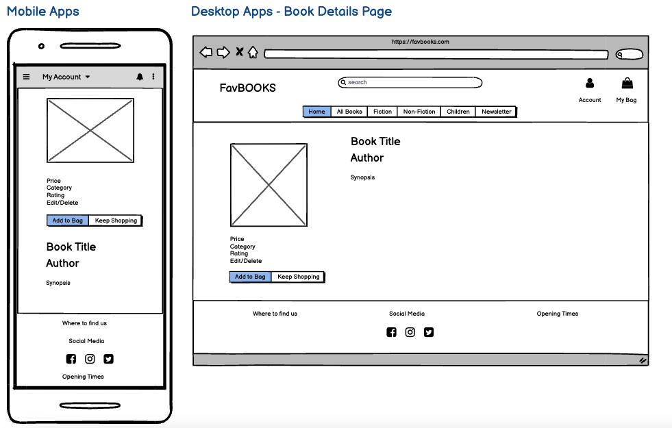
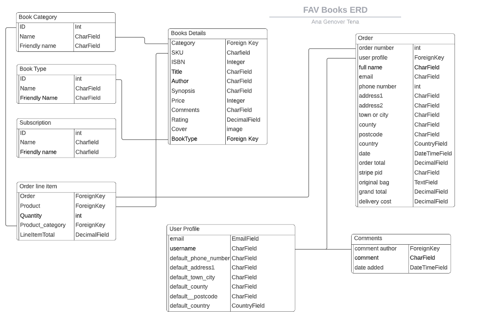

# **FavBOOKS**

[View the app in Heroku here](https://favbooks-v3.herokuapp.com/)

## **Table of Contents**

1. [About](#About)
2. [User Stories](#User-Stories)
3. [Features](#Features)
4. [Data Model](#Data-Model)
5. [Testing](#Testing)
6. [Technologies Used](#Technologies-Used)
7. [Deployment](#Deployment)
8. [Credits](#Credits)

## **About**

(Add site description)

## **User Stories**

| User Story ID  | As a/an  | I want to be able to...  | So that I can... |
|---|---|---|---|
| Viewing Products & Navigation |
| 1  | Site User | view a list of products | see what products I can purchase. |
| 2  |  | see the details of a specific product | make a more informed decision before a purchase about the price, rating. |
| 3  |  | see the details of a subscription | make a more informed decision before purchasing a subscription. |
| 4  |  | quickly identify the different sections of the site (book genres,  events, etc.) | navigate through the areas of my interest and discover new ones. |
| 5  |  | easily view what is on my cart | check all I need to purchase is correct. |
| 6  |  | easily view the total amount on my cart | check I am not spending too much. |
| Registration and User Accounts |
| 7  | User/Shopper | register for an account | get a profile for the site and view my profile. |
| 8  |  | login and logout | acces my personal information. |
| 9  |  | recover my password if forgotten | recover access to my account. |
| 10  |  | receive a registration confirmation email | verify my registration to the site was successfull. |
| 11  |  | be able to personalise my user profile | modify my personal information when necessary. |
| 12  |  | be able to access my user profile information | view my profile and what information is stored. |
| Searching and Sort Products |
| 13  | User/Shopper | sort the list of available products | easily identify best rated, best priced and categorycally sorted products. |
| 14  |  | sort a specific category of products | Find the best-priced, best-rated product in a specific category or sort the products in that category by author. |
| 15  |  | sort multiple categories of products at the same time | find the best-priced, best-rated product accross categories, such as "fantasy" or "Teen&Young Age". |
| 16  |  | search a product by name or description | find a specific product I would like to purchase |
| 17  |  | see my search results and how many products are matching | quickly decide wheter the product I want is available. |
| Checkout |
| 18  | Shopper | easily access my purchase history | be aware of my past purchases. |
| 19  |  | easily select the type and quantity of a product when purchasing it | be sure I make no mistakes about the quantity and type of book (paperback/hardcover). |
| 20  |  | be able to register/unregister for a monthly subscription | receive or stop receiving books every month. |
| Admin & Management (CRUD) |
| 21  | Admin User | Add new products (books&subscriptions) | offer new incoming products to my customers. |
| 22  |  | modify product details (books&subscriptions) | update the product details.  |
| 23  |  | delete products (books&subscriptions) | update the site when a product is not for selling anymore. |
| About the Site |
| 24  |  Site User | I am aware of the site Privacy Policy (GDPR compliant) | trust the site. |
| 25  |  | I see pop up messages when I make an action to confirm transactions and changes throughout my activity | rest assured my transactions have been successfull. |
| 26  |  | I can access the site's social media profiles | follow them if I want and stay up to date. |
| Popup Messages |
| 27  | Store owner/Admin | see a pop up message after submitting my purchase  | know if my transaction is been successfull or not.  |
| 28  |  | see a pop up message when adding/deleting products to my bag | be aware if my product was succesfully added or not to my cart. |
| 29  |  | see a pop up message when logging in/out of the site | be aware if I have logged in/out successfully or not. |
| 30  |  | see a pop up message when I subscribe/unsubscribe from a monthly subscription | be aware the action was successfull or not. |

## **Features**

#### **Existing Features**
- **Navigation Bar:** the navigation bar is available through all the pages on the site to ensure the site users can access any page they want at any time. In it the user can find a link to all books, different book actegories, sogn up for the newsletter and the home page. The site user and admin user can also login, logout, resgiter and access their shopping bag.

- **Footer:**  the footer is available through all the pages on the site as well, from there the site users can access the different social media pages, find the physical bookshop address and opening times.

-**Home Page:** the homepage is been kept pretty simple, the site user can see an image of the site as thr main background to create the effect they are already inside the bookshop. At its center there is the "Shop Now" link that takes the site user to see all the books available in the shop.

- **Login/Logout/Register:** situated on the top right corner this feature allows all user to register and create an account to access all the features of the site as well as to log in and out. There are two different levels of user, the admin user and site user. The admin user has extra access that allow them to add, update and remove books from the inline store.

- **Shopping Bag:** the shopping bag is also situated on the top right corner of the site and it is always visible for the user throughout all the pages. With one click they can access their shopping bag to see what is in there, update the quantities of book they wish to purchase or to delete them from the shopping bag.

- **Checkout:** The checkout feature is accessible through the shopping bag, once the site users have made their last decision about what to purchase and they are happy with it. At the checkout the site user can enter and save their personal details and see a summary of what they are about to purchase before entering their card details.

- **Add/Update/Delete Book:** the admin user is able to add, delete and update books into the site without having to enter the default 'admin site' from django. The admin user is the only type of user able to access this feature from two different places: first from 'Book Management' link in the 'My Account' menu from the navigation bar to create a new book, and second from the book details page where they have the option to 'edit' or 'delete' the book selected.

- **Newsletter:** all site users can sign up to receive a newsletter from FavBOOKS. This is accessible from the main navigation bar and if an address is already signed up an informational pop up message will inform the user of it.

- **Admin Site:** 

- **Pop Up Messages:** throughout the site, depending on the actions of the users different pop up messages will appear all along to inform the user of the actions taken. There are different levels of messages: information, success and error. For example, when adding a book to the shopping bag a message will appear informing so, when purchasing a product and everything worked correctly a success message will appear and in case something went wrong an error message will show and explain what went wrong. This ensures the users have extra information and do not unnecessarily repeat processes which might cause major issues (like for example when doing a purchase it would help avoiding an unnecesary double charge).

#### **Future Features**

- **Events:** From the navigation bar the site user will be able to access through a link the different events (past and future) the bookshop has created either virtually or in the store. From their side, the admin user will be able to access a restricted link to admin users only from the Account menu to add, edit or delete those events organised by the bookshop.

- **Reviews:** Site users will be able to see and add their own reviews to a particular book which will be visible from the book details page only. The reviews will appear from newest to oldest review added, and will also show the username of the site user, date and time the review was added.

- **My Wishlist:** Site users will be able to access a personalised list of books called "Wishlist", the link to this page will be accessible from the Accounts menu and they will be able to see the list of books in the wishlist and basic details (cover image, title, author and synopsis at least). The site user will be able to add/remove books they wish to read in the future from the books details page (through a link underneath the rating) and also through the book cards when searching for books by category (this would allow a speedy process to the site user as they do not need to enter the book details page and they can save books while the scroll through the books by category), the site user will also be able to remove books from the Wishilist through the same wishlist page using a button.

- **Subscriptions:** A link to the different subscriptions types will be available to the site user through the navigation bar, also another link to subscriptions will be available in the Accounts menu to the site user to manage their subscriptions (cancel a subscription or start one). Three different types of subscriptions will be available for the site user to adapt to the different needs and economic conditions of each user: annual, 6 months and monthly subscription.

### **Wireframes**
Below are the initial wireframes for the site for both desktop screens and smaller devices:

**Sitemap**

**Home Page**

**Category Page**

**Book Details Page**

## **Data Model**
The Entity Relationalship Database (ERD) below was created to develop this project, unfortunately due to time constraint not all the features could be developed.

The Book details are at the center of the ERD and they relate to the rest of the tables directly or indirectly. The site admin has CRUD (create, read, update and delete) access to all the books through the admin site as well as directly through the site itself, but the site user only has CRUD access to see the books created by the site admin.

Some of the [Future Features](#Future-Features) have been described in the ERD as well.

## **Testing**

#### **Remaining Bugs**

#### **Validator Testing**

- Used [PEP8online.com](http://pep8online.com/) to validate Python code.
- User [W3C](https://validator.w3.org/#validate_by_input) to validate HTML and CSS code

##### **Remaining errors**

## **Technologies Used**

- [Gitpod](https://gitpod.io/)
- [Github](https://github.com/)
- [Unsplash](https://unsplash.com/)
- [Lucidchart](https://www.lucidchart.com/pages/)
- [Fontawesome](https://fontawesome.com/start)
- [Django](https://www.djangoproject.com/)
- [Heroku](https://id.heroku.com/)
- [Balsamiq](https://balsamiq.cloud/)
- [PEP8online.com](http://pep8online.com/)
- [W3C](https://validator.w3.org/#validate_by_input)
- [Stackoverflow](https://stackoverflow.com/)
- [Bootstrap](https://getbootstrap.com/)
- [Coolors](https://coolors.co/)

## **Deployment**

The project is been deployed to Heroku and AWS. Steps for deployment:

- Deployment to Heroku:
    - Create an account in Heroku;
    - Create a new app in Heroku: choose a unique name and region;
    - On the resourcs tab provide a new Postgres database (used free plan for this project);
    - Go back to gitpod and install dj_database_url and psycopg2 and freeze the requirements in requirements.txt file to ensure Heroku installs our apps requirements when we deploy;
    - In settings.py import dj_database, comment out the default database configuration, replace it with a call to dj_database_url.parse and give it the database URL from Heroku (which can be found in the settings tab);
    - Migrate all the changes;
    - Import all the books, categories and subcategories using the command 'python3 manage.py load data name';
    - Create a super user using command 'python3 manage.py createsuperuser' and follow terminal instructions;
    - Create an if statement in settings.py to allow the system to take the database from os.environ if it exists otherwise it will use the default configuration.
    - Install gunicorn in the terminal and freeze to requirements.txt file;
    - Create a Procfile to tell Heroku to create a web dyno;
    - Temporarily disable collect_static using command 'heroku config:set DISABLE_COLLECT_STATIC=1';
    - In settings.py add the hostname of the heroku app and a localhost so that gitpod will keep working;
    - Add, commit and push changes to github, then use command 'git push heroku main' to deploy to Heroku;
    - In Heroku, inside the app, go to the Deploy tab and set it to deploy to github, search for the project repository and click connect. Once connected set up automatic deploys (due to recent issues shared by the Heroku team automatic deploys have been temporarily disabled);
    - Generate a secret key for the Heroku app and add it to the env.py file (which is included in .gitignore file to keep all the keys secret and safe);
    - In settings.py set up debug to true only if there is a variable called development in the environment;

- Deployment to AWS:
    - 

    - Introduce sensitive data needed to be kept secret from the config Var tab in env.py and attach the database (Cloudinary url, Database url and Secret Key);
    - Add necessary buildpacks: Python;
    - Prepare environment and settings.py file by referencing env.py and link the database variable on Heroku;
    - Migarte all the changes;
    - Get all static and media files stored in Cloudinary by adding the cloudinary url in env.py and in Heroku, add Cloudinary to settings.py as well as telling Django, link the file to the templates in Heroku and allow Heroku as a host in Allowed_Hosts;
    - In Gitpod create the media, static and templates directories;
    - Add the project name in Procfile;
    - Make deployment commit in the terminal;
    - Manually deploy content through Heroku;
    - For deployment method, GitHub was selected and confirmed we want to connect to GitHub;
    - Connect Heroku to the repository for My Recipe Blog a;
    - Set "Enable Automatic Deploys" to allow automatic deployments every time the code is pushed;
    - Click on Deploy.
    - For final deployment:
        - In settings.py set Default = False;
        - Below add X_FRAME_OPTIONS = 'SAMEORIGIN';
        - Commit and push the changes in the terminal;
        - In Heroku, in the settings tab remove the DISABLE_COLLECTSTATIC variable;
        - In Heroku, go to the deploy tab and click on deploy branch.

## **Credits**

[Back to Top ⇧](#FavBOOKS) 