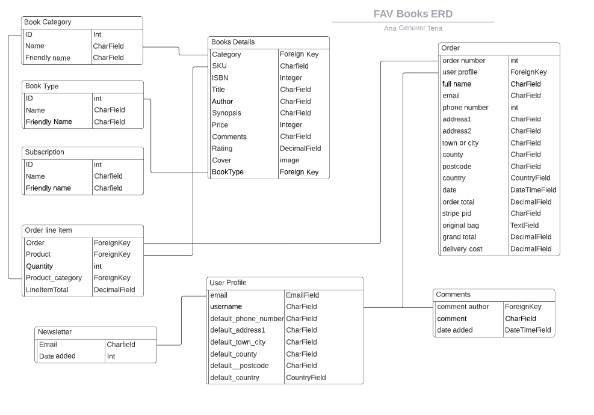
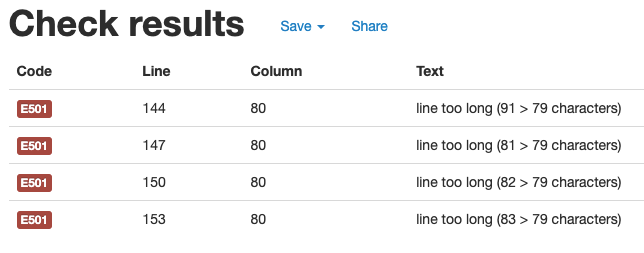
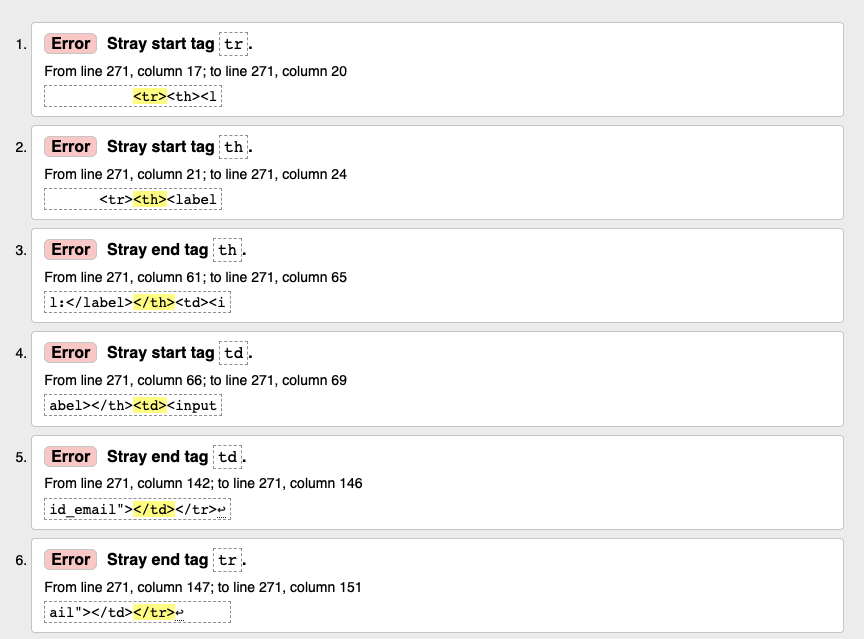

# **FavBOOKS**

[View the app in Heroku here](https://favbooks-v3.herokuapp.com/)

## **Table of Contents**

1. [About](#About)
2. [Marketing and SEO](#Marketing-and-SEO)
3. [User Stories](#User-Stories)
4. [Features](#Features)
5. [Data Model](#Data-Model)
6. [Testing](#Testing)
7. [Technologies Used](#Technologies-Used)
8. [Deployment](#Deployment)
9. [Credits](#Credits)

## **About**

FavBOOKS is an imaginery bookshop in central London and its website provides the user the opportunity to find their next favourite book from the comfort of home. The books are divided in different general genres with different subgenres to allow the user find what they are looking for or to discover something new. Once a book is been found the user can purchase the selected book or books and have them delivered at home. The user is also able to subscribe the the newsletter to receive news about the bookshop.

## **Marketing and SEO**

#### **Marketing**
FavBOOKS is a business to customer e-commerce platform with a physical shop in central London as well. The site is built and designed to sell books to the user and inform customers about any news throught the newsletter.

The following questions were answered previous to the implementation stage to ensure that the needs of the user were met. During the implementation stage the points below described were implemented or will be implemented in future features.

- **What do your users need?**
    - Find the books they are looking for and be able to buy them.
    - Find new recommendations.
    - Find feedback from other readers to be able to make a more informed choice.
    - Meet a community that enjoys literature and meets from time to time and brings together writers and readers.
    - Find a space where they can be creative and expand their cultural knowledge.
    - Cultural programme.
    - Podcast.
    - Stay informed: Newsletter subscription with news and events.

- **What information and feature can I provide to meet those needs?**
Find the books they are looking for and be able to buy them: 
    - Through a list of all the books that can be found at the bookshop and be able to filter them according to their preferences.
    - Search bar
    - Click and collect service
    - Delivery
    - Find new recommendations: through a monthly subscription that chooses for the reader five books based on their preferences.
    - Find feedback: all registered users can leave a comment and rate the books they have read.
    - Stay informed: Newsletter subscription with news and events organised at the bookshop.

- **How can I make the information easy to understand?**
Clear and well structured sections and easy to understand language based on the SEO keywords

- **How can I demonstrate expertise, authoritativeness, and trustworthiness in your content?**
    - High-quality design and images.
    - Registered users are not bombarded with spam emails.
    - Comments from other users on books are regulated and there are terms and conditions.
    - Links to other high-quality pages.

- **How can I help users discover other relevant parts of your web application?**
Through a navbar where they can easily see and access the different sections, they can also change from one section to another without having to click back and/or get lost in the process.

- **Facebook Page:**
To further enhance sales there is also a FavBOOKS Facebook page, that will display information about new books or events: 

#### **SEO**
The lists below shows all the keywords that came up during brainstorimg, the striked words are the ones that will not be used. The rest have been inomplemented or will be implemented when developing future features.

1-	General Topics
-	Books
-	Book Gifts
-	Book writer/author
-	Book Collection
-	Book Languages
-	Book Genre
 

2-	Keywords for each topic
-	Books:
    -	Hardback (title)
    -	Paperback (title)
    -	Books to read
    -	What book to read?

-	Book Gifts:
    -	Best books to gift
    -	Book lovers’ gift
    -	~~Book gift for kids/toddlers/~~
    -	~~Book gift for him/her~~
    -	~~Book gift for children/friends/Christmas/Summer/…~~
    -	~~How do I send a book as a gift?~~

-	Book writer/author:
    -	Best-selling author 2021
    -	Best new books 2021
    -	Best author/writer/novelist of all times
    -	Best male/female authors
    -	Famous male/female authors
    -	English/Spanish/… story writers
    -	~~Best Author of 2022~~

-	Book Collection:
    -	Vintage books
    -	~~Rare collection books~~
    -	~~Unique books~~
    -	~~Beautiful books~~
    -	~~Original books~~
    -	~~Book collection for adults/kids/toddlers~~

-	Book Languages:
    -	Best (language) novels
    -	Best (language) books for beginners/intermediate/advanced learners
    -	~~(Book title) in (language)~~
    -	~~Books in (language)~~
    -	~~What language has the best books?~~
    -	~~Best (language) books for toddlers~~

-	Book Genre: 
    -	Best crime books
    -	Mystery novels
    -	Fiction books
    -	Horror books
    -	Children books to read
    -	Great illustrated classics
    -	Poetry books
    -	(author) poems
    -	Books about love
    -	Literary nonfiction
    -	Good nonfiction books
    -	Contemporary literature
    -	Graphic novels
    -	~~Genres of books for kids/adults~~
    -	~~Nonfiction~~
    -	~~Classic novels~~
    -	~~Book genre trends~~

## **User Stories**

| User Story ID  | As a/an  | I want to be able to...  | So that I can... |
|---|---|---|---|
| Viewing Products & Navigation |
| 1  | Site User | view a list of products | see what products I can purchase. |
| 2  |  | see the details of a specific product | make a more informed decision before a purchase about the price, rating. |
| 3  |  | see the details of a subscription | make a more informed decision before purchasing a subscription. |
| 4  |  | quickly identify the different sections of the site (book genres,  events, etc.) | navigate through the areas of my interest and discover new ones. |
| 5  |  | easily view what is on my cart | check all I need to purchase is correct. |
| 6  |  | easily view the total amount on my cart | check I am not spending too much. |
| Registration and User Accounts |
| 7  | User/Shopper | register for an account | get a profile for the site and view my profile. |
| 8  |  | login and logout | acces my personal information. |
| 9  |  | recover my password if forgotten | recover access to my account. |
| 10  |  | receive a registration confirmation email | verify my registration to the site was successfull. |
| 11  |  | be able to personalise my user profile | modify my personal information when necessary. |
| 12  |  | be able to access my user profile information | view my profile and what information is stored. |
| Searching and Sort Products |
| 13  | User/Shopper | sort the list of available products | easily identify best rated, best priced and categorycally sorted products. |
| 14  |  | sort a specific category of products | Find the best-priced, best-rated product in a specific category or sort the products in that category by author. |
| 15  |  | sort multiple categories of products at the same time | find the best-priced, best-rated product accross categories, such as "fantasy" or "Teen&Young Age". |
| 16  |  | search a product by name or description | find a specific product I would like to purchase |
| 17  |  | see my search results and how many products are matching | quickly decide wheter the product I want is available. |
| Checkout |
| 18  | Shopper | easily access my purchase history | be aware of my past purchases. |
| 19  |  | easily select the type and quantity of a product when purchasing it | be sure I make no mistakes about the quantity and type of book (paperback/hardcover). |
| 20  |  | be able to register/unregister for a monthly subscription | receive or stop receiving books every month. |
| Admin & Management (CRUD) |
| 21  | Admin User | Add new products (books&subscriptions) | offer new incoming products to my customers. |
| 22  |  | modify product details (books&subscriptions) | update the product details.  |
| 23  |  | delete products (books&subscriptions) | update the site when a product is not for selling anymore. |
| About the Site |
| 24  |  Site User | I am aware of the site Privacy Policy (GDPR compliant) | trust the site. |
| 25  |  | I see pop up messages when I make an action to confirm transactions and changes throughout my activity | rest assured my transactions have been successfull. |
| 26  |  | I can access the site's social media profiles | follow them if I want and stay up to date. |
| Popup Messages |
| 27  | Store owner/Admin | see a pop up message after submitting my purchase  | know if my transaction is been successfull or not.  |
| 28  |  | see a pop up message when adding/deleting products to my bag | be aware if my product was succesfully added or not to my cart. |
| 29  |  | see a pop up message when logging in/out of the site | be aware if I have logged in/out successfully or not. |
| 30  |  | see a pop up message when I subscribe/unsubscribe from a monthly subscription | be aware the action was successfull or not. |

## **Features**

#### **Existing Features**
- **Navigation Bar:** the navigation bar is available through all the pages on the site to ensure the site users can access any page they want at any time. In it the user can find a link to all books, different book categories, sign up for the newsletter and the home page. The site user and admin user can also login, logout, resgiter and access their shopping bag.

- **Footer:**  the footer is available through all the pages on the site as well, from there the site users can access the different social media pages, find the physical bookshop address and opening times.

-**Home Page:** the homepage is been kept pretty simple, the site user can see an image of the site as the main background to create the effect they are already inside the bookshop. At its center there is the "Shop Now" link that takes the site user to see all the books available in the shop.

- **Login/Logout/Register:** situated on the top right corner this feature allows all user to register and create an account to access all the features of the site as well as to log in and out. There are two different levels of user, the admin user and site user. The admin user has extra access that allow them to add, update and remove books from the inline store.

- **Shopping Bag:** the shopping bag is also situated on the top right corner of the site and it is always visible for the user throughout all the pages. With one click they can access their shopping bag to see what is in there, update the quantities of book they wish to purchase or to delete them from the shopping bag.

- **Checkout:** The checkout feature is accessible through the shopping bag, once the site users have made their last decision about what to purchase and they are happy with it. At the checkout the site user can enter and save their personal details and see a summary of what they are about to purchase before entering their card details.

- **Add/Update/Delete Book:** the admin user is able to add, delete and update books into the site without having to enter the default 'admin site' from django. The admin user is the only type of user able to access this feature from two different places: first from 'Book Management' link in the 'My Account' menu from the navigation bar to create a new book, and second from the book details page where they have the option to 'edit' or 'delete' the book selected.

- **Newsletter:** all site users can sign up to receive a newsletter from FavBOOKS. This is accessible from the main navigation bar and if an address is already signed up an informational pop up message will inform the user of it.

- **Pop Up Messages:** throughout the site, depending on the actions of the users different pop up messages will appear all along to inform the user of the actions taken. There are different levels of messages: information, success and error. For example, when adding a book to the shopping bag a message will appear informing so, when purchasing a product and everything worked correctly a success message will appear and in case something went wrong an error message will show and explain what went wrong. This ensures the users have extra information and do not unnecessarily repeat processes which might cause major issues (like for example when doing a purchase it would help avoiding an unnecesary double charge).

#### **Future Features**

- **Events:** From the navigation bar the site user will be able to access through a link the different events (past and future) the bookshop has created either virtually or in the store. From their side, the admin user will be able to access a restricted link to admin users only from the Account menu to add, edit or delete those events organised by the bookshop.

- **Reviews:** Site users will be able to see and add their own reviews to a particular book which will be visible from the book details page only. The reviews will appear from newest to oldest review added, and will also show the username of the site user, date and time the review was added.

- **My Wishlist:** Site users will be able to access a personalised list of books called "Wishlist", the link to this page will be accessible from the Accounts menu and they will be able to see the list of books in the wishlist and basic details (cover image, title, author and synopsis at least). The site user will be able to add/remove books they wish to read in the future from the books details page (through a link underneath the rating) and also through the book cards when searching for books by category (this would allow a speedy process to the site user as they do not need to enter the book details page and they can save books while the scroll through the books by category), the site user will also be able to remove books from the Wishilist through the same wishlist page using a button.

- **Subscriptions:** A link to the different subscriptions types will be available to the site user through the navigation bar, also another link to subscriptions will be available in the Accounts menu to the site user to manage their subscriptions (cancel a subscription or start one). Three different types of subscriptions will be available for the site user to adapt to the different needs and economic conditions of each user: annual, 6 months and monthly subscription.

### **Wireframes**
Below are the initial wireframes for the site for both desktop screens and smaller devices:

**Sitemap**

**Home Page**

**Category Page**

**Book Details Page**

## **Data Model**
The Entity Relationalship Database (ERD) below was created to develop this project, unfortunately due to time constraint not all the features could be developed.

The Book details are at the center of the ERD and they relate to the rest of the tables directly or indirectly. The site admin has CRUD (create, read, update and delete) access to all the books through the admin site as well as directly through the site itself, but the site user only has view access to see the books created by the site admin.

Some of the [Future Features](#Future-Features) have been described in the ERD as well.

## **Testing**

Testing is been done manually and have gone through all the features the site provides for all types of screens, from small to desktop screens. All the features responding as expected with the exceptions explained below in Remaining Bugs.

- **Login/logout/register:** The user can use all these features with no errors, pop up messages appearing as well.

- **Search bar:** Working and showing all the books containing the searched words, if search button is clicked a message stating what was the search word appears on top of the page.

- **Navigation bar:** All the links to the different categories (including their dropdown menus) and the newsletter link are working correctly and showing the expected list of books.

- **Book details:** All the details entered for a book are present and all the links are clickable and none are broken. The site user can see all book details, click on 'quantity', 'add to bag' or 'keep shopping' only; while the admin user has the extra access to 'edit' and 'delete' links (which are fully functional).

- **Book Management:** From 'My Account' dropdown menu the superuser can add books, the form is working as expected and images are added with no issues. The 'Add' and 'Cancel' buttons are working as well.

- **Footer:** All the links to social media working correctly and as expected, no broken links.

- **My account:** The dropdown menu works as expected and no broken links. When clicking the menu responds to the different types of users (admin functions appear when superuser is logged in and not present for site users) and if the user is logged in or not.

- **Bag:** The feature is working as expected as well, link to the selected books are working correctly, the quantity can be amended as well with no issues (quantity doesn't go beyond 99 or below 1), 'Update' and 'Remove' buttons working as well as 'Keep Shopping' and 'Secure Checkout'.

- **Checkout:** Page loading successfully, delivery information also adds correctly to the delivery form as well as good functioning of 'Adjust Bag' and 'Complete Order' buttons. The summary of selected items to buy show correctly including the book cover, name, author, quantity selected, subtotal, total, delivery amount and grand total.

- **Newsletter:** Subscribing for the newsletter feature working correctly, when subscribing with a new email and confirmation email is sent to the entered address and if an existing email address is added an informational pop up message appears informing so.

- **My profile:** Both site user and superuser can enter access their profile information through 'My Account' dropdown menu. The default delivery information can be updated with no issues, and the order history is available, the links to each order details is accessible (no broken links) and after checking an order information the user can go back to their profile and order history.

- **Pop Up Messages:** All pop up messages working correctly and appearing when expected:
    - Confirmation messages when logging in/out and registering, when adding an item to the bag, when signing up for the newsletter and when making a purchase.
    - Information messages: when an information to the user is required, i.e. when an email address is already subscribed to receive the newsletter.
    - Warning messages: when something goes wrong and the user must know what happened, i.e. when there is an issue with a purchase and it couldn't be processed.

#### **Remaining Bugs**

The only remaining bug detected is on the padding top of the 'main' section, which inlcudes all the content the site offers. Due to the different screen sizes, the very top of the 'div' hides behind the navigation bar (only the title in most part of the occasions) and it only happens for desktop size screens. The issue is been addressed by creating a new class and adding the extra top padding necessary for each screen type. This works well but for some reason, from time to time (so not always or in a consistent way), the title hides behind the navigation bar. I have modified the padding top size numerous times but now and then it occurs, but when loading the page again it disappears.

No more bugs have been found.

#### **Validator Testing**

- Used [PEP8online.com](http://pep8online.com/) to validate Python code.
- Used [W3C](https://validator.w3.org/#validate_by_input) to validate HTML and CSS code
- Used [JSHint](https://jshint.com/) to validate JavaScript code

##### **Remaining errors**
- The file settings.py in the favbooks-v3 folder has 4 error error codes E501 in lines 144, 147, 150 and 153 stating the lines are too long. I have left as they are because the referred lines are password validators and can't be broken.

- The page https://favbooks-v3.herokuapp.com/newsletter/newsletter_signup/ shows 6 errors in W3C validator but this is related to the form created in form.py in the "newsletter app" so I have researched and couldn't find a solution. Also the error relates to stray start tag <tr> <th> and <td> in one hand and in the other hand stray end tag <tr> <th> and <td>, which are actually matching.

## **Technologies Used**

- [Gitpod](https://gitpod.io/)
- [Github](https://github.com/)
- [Unsplash](https://unsplash.com/)
- [Lucidchart](https://www.lucidchart.com/pages/)
- [Fontawesome](https://fontawesome.com/start)
- [Django](https://www.djangoproject.com/)
- [Heroku](https://id.heroku.com/)
- [Balsamiq](https://balsamiq.cloud/)
- [PEP8online.com](http://pep8online.com/)
- [W3C](https://validator.w3.org/#validate_by_input)
- [Stackoverflow](https://stackoverflow.com/)
- [Bootstrap](https://getbootstrap.com/)
- [Coolors](https://coolors.co/)
- [Unsplash](https://unsplash.com/)

## **Deployment**

The project is been deployed to Heroku and AWS. Steps for deployment:

- Deployment to Heroku:
    - Create an account in Heroku;
    - Create a new app in Heroku: choose a unique name and region;
    - On the resourcs tab provide a new Postgres database (used free plan for this project);
    - Go back to gitpod and install dj_database_url and psycopg2 and freeze the requirements in requirements.txt file to ensure Heroku installs our apps requirements when we deploy;
    - In settings.py import dj_database, comment out the default database configuration, replace it with a call to dj_database_url.parse and give it the database URL from Heroku (which can be found in the settings tab);
    - Migrate all the changes;
    - Import all the books, categories and subcategories using the command 'python3 manage.py load data name';
    - Create a super user using command 'python3 manage.py createsuperuser' and follow terminal instructions;
    - Create an if statement in settings.py to allow the system to take the database from os.environ if it exists otherwise it will use the default configuration.
    - Create a Procfile to tell Heroku to create a web dyno;
    - Temporarily disable collect_static using command 'heroku config:set DISABLE_COLLECT_STATIC=1';
    - In settings.py add the hostname of the heroku app and a localhost so that gitpod will keep working;
    - Deploy to Heroku;
    - In Heroku, inside the app, go to the Deploy tab and set it to deploy to github, search for the project repository and click connect. Once connected set up automatic deploys (due to recent issues shared by the Heroku team automatic deploys have been temporarily disabled);
    - Generate a secret key for the Heroku app and add it to the env.py file (which is included in .gitignore file to keep all the keys secret and safe);
    - In settings.py set up debug to true only if there is a variable called development in the environment;

- Deployment to AWS S3:
    - Navigate to https://aws.amazon.com/ and create an account;
    - Once logged in, from the AWS Management Console page, find the S3 service in the 'Find Services' search bar to create a new bucket where our files will be stored;
    - Create a bucket: 
        - With a matching name with your app to keep things organised;
        - Select your closest region;
        - Uncheck 'block all public access' and acknowledge that the bucket will be public; 
        - Under Bucket Ownership section select 'ACLs enabled';
        - Select Create Bucket;
    - Inside our new bucket:
        - In the properties tab turn on static website hosting to create a new endpoint accessible from the internet;
        - In the permissions tab we will make 3 changes: 
            - Paste in new CORS Configuration:
                                        [
                        {
                        "AllowedHeaders": [
                        "Authorization"
                        ],
                        "AllowedMethods": [
                        "GET"
                        ],
                        "AllowedOrigins": [
                        "*"
                        ],
                        "ExposeHeaders": []
                        }
                        ]
            - In the policy tab click on policy generator and create a new policy and copy it in the policy editor and before saving add /* at the end of the resource key to allow access to all resources in the bucket;
            - In the Access Control List tab click edit and enable List for Everyone (public access) and accept the warning box;
    - Now that the bucket is ready, we need to create a user to access it, we will create through the service called IAM (Identity Access Management):
        - Access IAM through the Services menu;
        - Click User Groups on the side menu and click Create New Group and call it manage-favbooks-v3 (to match our website again and have consistency) and click on Create Group;
        - On the side menu clik on Policies and then click on Create Policies;
        - In the JSON tab select 'import managed policy' which will let us import the 'S3 Full Access Policy' that AWS has pre-built for full access to S3. But because we only want to allow full access to our bucket we need to get the bucket ARN from the bucket policy page in S3 and paste it under Resource as a list. We will paste twice, the first item is the ARN as it is and the second item with /* at the end to add another rule for all files and folders in the bucket;
        - Click review policy, give it a name and description and click Create Policy;
        - To attach the policy to the group we created click on User Groups, select manage-favbooks-v3, click Attach Policy, search policy created, select it and click Attach Policy;
        - Now we need to create a user to put in the group: click Users in the sidebar menu;
        - Create the user favbooks-v3-staticfiles-user, select Programmatic Access and select Next;
        - From the list provided select manage-favbooks-v3 and click Create User;
        - Click on 'Download .csv' which will contain the users access key and secret access keyn that we will use to authenticate them from our Jango app. It is very important you download and save this CSV file as it won't be downloadable again after this process.
    - Configure Django to connect to S3 uing the keys we just created:
        - In settings.py file, under the Static Files section create an IF statement to check if there is an environment variable called USE_AWS in the environment;
        - In the IF statement define the AWS_STORAGE_BUCKET_NAME, AWS_S3_REGION_NAME, access key and secreat access key we will get from the environment to keep them secure;
        - In Heroku, in the Config Vars section of the Settings tab:
            - Add the AWS keys;
            - Set USE_AWS to True;
            - Remove the DISABLE_COLLECTSTATIC variable;
        - In settings.py in gitpod set up the bucket name;
        - Create a new file called custom_storages.py:
            - Import settings from django and s3boto3 storage class from django storages;
            - Create a new class called static_storages that inherits from django s3boto3;
            - Tell the class that we want to store static files in a location from the settings that we'll define in a moment;
            - Create an exact same class but for media;
        - In settings.py and set a variable that points to the new storage classes we just created and that the location it should save static files is a folder called 'static'. Do the same for media files;
        - Now we need to override and explicitly set the URLs for static and media files using our custom domain and the new locations.
        - Deploy to Heroku. Once the deployment to Heroku is successful, if we go to S3, we can see that we have a static folder in our bucket with all our static files in it. Basically, what is hapenning now, when our project is deployed to Heroku, it will run python3 manage.py collectstatic during the build process and will search through all the apps and project folders looking for static files. It will use the S3 custom domain setting with our custom storage classes that will tell the location where we want to save things. This means that when USE_AWS is set to TRUE, whenever collectstatic is run, static files will be collected into a static folder in our s3 bucket;
    - Go to S3 and create a new folder called 'media', inside this folder click 'upload', 'add files' and then select all the book cover images.

- Stripe:
    - Add all the Stripe keys to the Heroku Config Variables;
    - Create a new Stripe wehbhook endpoint using the new address: https://favbooks-v3.herokuapp.com/;
    - Test the webhook is working correctly by creating and test order through our new deployed site in Heroku;

## **Credits**

I would like to thanks both my parents and my two borthers for their support no matter what and for cheering me in every single step of the way.

A special thank you to Chris Quinn as well, my mentor throughout all my projects at Code Institute. I have learned a lot from him and made me feel reassured when I was feeling things were not going well. I can't thank him enough!

[Back to Top ⇧](#FavBOOKS) 